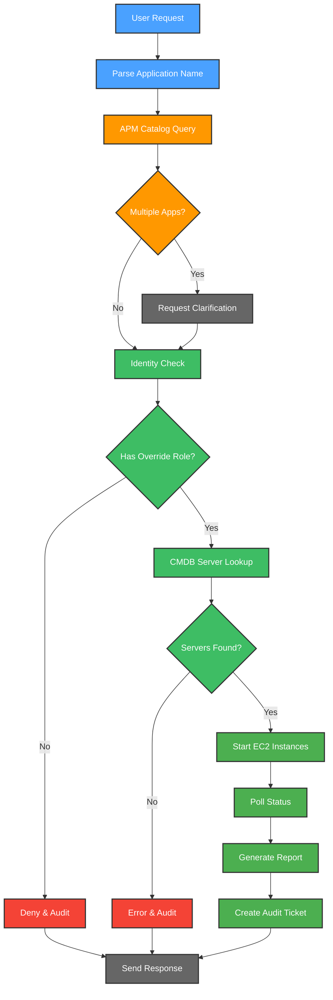

# 🖥️ Self Service Servers

Self Service Servers is your intelligent companion within the Kubiya platform, designed to handle server curfew override requests through Microsoft Teams or Slack with comprehensive ServiceNow integration. It provides autonomous server management with full audit trails and compliance tracking.

**🎯 Transform your server management with AI-powered automation! Handle curfew overrides, validate permissions, and maintain compliance through intelligent workflows.**

## 🌟 Features

- 🤖 **AI-Powered Automation**: Autonomous server curfew override handling
- 🔐 **Permission Validation**: Automatic user identity and role verification
- 📊 **ServiceNow Integration**: Seamless APM catalog and CMDB queries
- ☁️ **AWS Management**: Direct EC2 instance control and monitoring
- 🛡️ **Compliance Tracking**: Comprehensive audit trail creation
- 🔍 **Application Discovery**: Intelligent app name resolution
- 📈 **Real-time Updates**: Progress tracking with emoji indicators
- 🚨 **Error Handling**: Robust failure management and reporting

## 🔄 User Flows

### 1. 🖥️ Server Curfew Override Flow

## 🛠️ Configuration

Below are the key variables used to configure the Self Service Servers teammate:

| Variable Name | Description | Type | Default |
|---------------|-------------|------|---------|
| `teammate_name` | Name of the Self Service Servers teammate | `string` | `self-service-servers` |
| `kubiya_runner` | Runner to use for the teammate | `string` | *Required* |
| `servicenow_username` | ServiceNow username for authentication | `string` | *Required* |
| `servicenow_instance` | ServiceNow instance URL | `string` | *Required* |
| `aws_default_region` | AWS default region for EC2 operations | `string` | *Required* |
| `kubiya_groups_allowed_groups` | Groups allowed to interact with the teammate | `list(string)` | `['Admin', 'Users']` |
| `debug_mode` | Enable detailed debugging output | `bool` | `false` |

## 🚀 Getting Started

1. **Log into Kubiya Platform**:
   - Visit [app.kubiya.ai](https://app.kubiya.ai)
   - Log in with your credentials

2. **Navigate to Use Cases**:
   - Go to "Teammates" section
   - Click on "Use Cases"
   - Click "Add Use Case"
   - Select "Self Service Servers"

3. **Configure Settings**:
   Fill in the required fields:
   - Teammate Name
   - Kubiya Runner
   - ServiceNow Username
   - ServiceNow Instance
   - AWS Default Region
   - Allowed Groups
   - Debug Mode

4. **Set Up Secrets**:
   - Configure `SERVICENOW_PASSWORD` secret in Kubiya
   - Ensure AWS credentials are properly configured

5. **Deploy**:
   - Review your configuration
   - Click "Deploy Use Case"
   - Wait for confirmation

## 🎭 Example Scenarios

### Scenario 1: Successful Server Startup

1. **Request**: User asks "Please start the production web servers"
2. **Discovery**: Assistant finds "production-web" application in APM catalog
3. **Validation**: User has `x_curfew_override` role
4. **Lookup**: Finds 3 EC2 instances in CMDB
5. **Execution**: Starts all 3 instances successfully
6. **Audit**: Creates ServiceNow ticket with success status
7. **Response**: Reports server IPs, regions, and completion status

### Scenario 2: Permission Denied

1. **Request**: User asks "Start the database servers"
2. **Discovery**: Finds "database-cluster" application
3. **Validation**: User lacks required override role
4. **Audit**: Creates ticket with `unauthorized_attempt` action
5. **Response**: Polite denial with escalation suggestion

### Scenario 3: Application Not Found

1. **Request**: User asks "Start my-app servers"
2. **Discovery**: No exact match in APM catalog
3. **Suggestion**: Provides similar application names
4. **Audit**: Creates ticket with `app_not_found` action
5. **Response**: Suggests clarification or similar apps

## 🔧 Available Tools

The Self Service Servers teammate has access to the following tools:

- **servicenow_apm_catalog_query**: Find applications/services by name
- **servicenow_identity_check**: Validate user identity and roles
- **servicenow_cmdb_query**: Fetch servers for a given application
- **aws_cli_command**: Check/start EC2 instances
- **servicenow_audit_ticket**: Create ServiceNow audit tickets

## 📊 Key Benefits

- ⚡ **Autonomous Operation**: Runs end-to-end without human intervention
- 🔒 **Security First**: Validates permissions before any actions
- 📈 **Full Compliance**: Every action is audited in ServiceNow
- 🎯 **Application Scoped**: Only affects servers for requested applications
- 📝 **Comprehensive Logging**: Detailed audit trails for compliance
- 🚀 **Real-time Feedback**: Progress updates with clear status indicators
- 🛡️ **Error Resilience**: Robust handling of failures and edge cases

## 🔍 Workflow Details

### Permission Requirements
- Users must have `x_curfew_override` role in ServiceNow
- Identity validation occurs automatically for each request
- Unauthorized attempts are logged and audited

### Server Management
- Only servers directly associated with the requested application are affected
- CMDB relationships and `u_application` field are used for filtering
- AWS EC2 instances are started and monitored until running state

### Audit Trail
- Every request (successful or failed) creates a ServiceNow audit ticket
- Tickets include user, action, application, servers, status, and details
- Compliance tracking ensures full visibility into server operations

---

Ready to automate your server management with intelligent workflows? Deploy your Self Service Servers teammate today! 🚀

**[Get Started](https://app.kubiya.ai)** | **[Documentation](https://docs.kubiya.ai)** | **[Request Demo](https://kubiya.ai)**

---

*Let Self Service Servers handle your curfew overrides with confidence and compliance! 🖥️✨*
